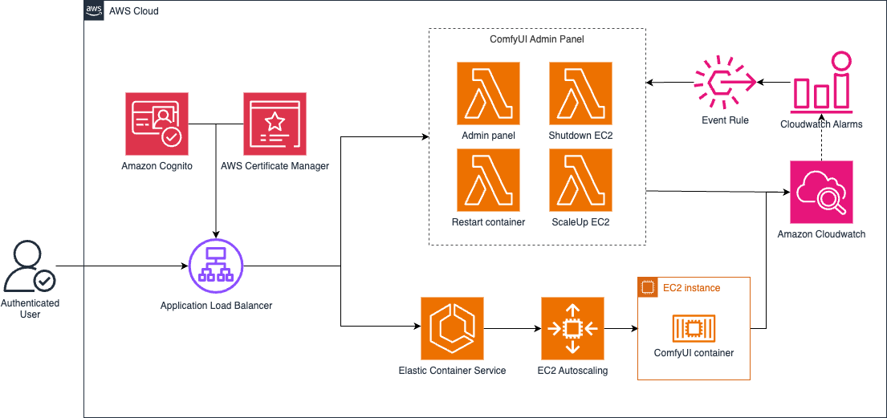
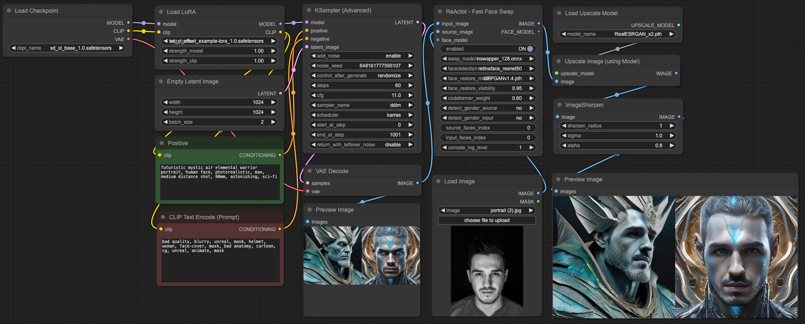

# ComfyUI on AWS

[](https://opensource.org/licenses/MIT)

This repository contains the infrastructure code and configuration to deploy ComfyUI on AWS using ECS, EC2, and other AWS services. The setup considers a cost-effective deployment without compromising security.

💡 Note: this solution will incur AWS costs. You can find more information about it in the costs section.


## Architecture Overview



## Services

- **[Amazon VPC](https://docs.aws.amazon.com/vpc/latest/userguide/what-is-amazon-vpc.html)** - A VPC with public and private subnets is created to host the ECS cluster
- **[ECS Cluster](https://docs.aws.amazon.com/AmazonECS/latest/developerguide/clusters.html)** - An ECS cluster is created to run the ComfyUI task
- **[Auto Scaling Group](https://docs.aws.amazon.com/autoscaling/ec2/userguide/auto-scaling-groups.html)** - An ASG is created and associated with ECS as a capacity provider. It launches GPU instances to host ECS tasks.
- **[ECS Task Definition](https://docs.aws.amazon.com/AmazonECS/latest/developerguide/task_definitions.html)** - Defines the ComfyUI container and mounts EBS volume for persistence
- **[ECS Service](https://docs.aws.amazon.com/AmazonECS/latest/developerguide/ecs_services.html)** - Creates an ECS service to run the ComfyUI task definition
- **[Application Load Balancer](https://docs.aws.amazon.com/elasticloadbalancing/latest/application/introduction.html)** - An ALB is setup to route traffic to the ECS service 
- **[Log Bucket](https://docs.aws.amazon.com/elasticloadbalancing/latest/application/load-balancer-access-logs.html)** - An S3 bucket stores ALB access logs 
- **[Amazon ECR](https://docs.aws.amazon.com/AmazonECR/latest/userguide/what-is-ecr.html)** - Holds the ComfyUI Docker image
- **[CloudWatch Log Group](https://docs.aws.amazon.com/AmazonCloudWatch/latest/logs/Working-with-log-groups-and-streams.html)** - Stores logs from the ECS task
- **[Amazon Cognito](https://docs.aws.amazon.com/cognito/latest/developerguide/cognito-user-identity-pools.html)** - User directory for having authentication in front of the ALB
- **[AWS Lambda](https://docs.aws.amazon.com/lambda/)** - To manage ComfyUI state

## Getting Started

For the sake of reproducability and consistency, we recommend using [AWS Cloud9](https://docs.aws.amazon.com/cloud9/latest/user-guide/welcome.html) IDE for deploying and testing this solution.  
  
ℹ️ You can use your local development environment, but you will need to make sure that you have AWS CLI, AWS CDK and Docker properly setup. Additionally, if you're building your docker image using apple chips (M1, M2, etc.) then you need to use the Docker ```docker build --platform linux/amd64 .``` command.


#### Create Cloud9 Environment
1. Login to AWS Console
2. Navigate to Cloud9
3. Create Environment with following example details:
    - Name: Give your Dev Environment a name of choice
    - Instance Type: t2.micro (default) got a free-tier
    - Platform: Ubuntu Server 22.04 LTS
    - Timeout: 30 minutes
    - Other settings can be configured with the default values
4. Create and open environment
5. resize disk space
    ```bash
    curl -o resize.sh https://raw.githubusercontent.com/aws-samples/semantic-search-aws-docs/main/cloud9/resize.sh
    chmod +x ./resize.sh
    ./resize.sh 100
    ```
6. git clone <enter this repo URL here>
7. cd into new directory

#### Prepare the AWS environment

ℹ️ If you're not using Cloud9, then make sure that you execute the following commands on your local environment:

```bash
aws configure
```
When prompted, enter your AWS Access Key ID, Secret Access Key, and then the default region name (eg. us-east-1). You can leave the output format field as default or specify it as per your preference.

You can change the used AWS account 
```bash
echo "export AWS_DEFAULT_ACCOUNT=$(aws sts get-caller-identity --query Account --output text)"
# alternatively: export AWS_DEFAULT_ACCOUNT=<your_account_id> # e.g. 123456789012
```
and region by setting the env variables below. You can also define the ECR repository name.
```bash
echo "export AWS_DEFAULT_REGION=$(aws configure get region)"
# alternatively: export AWS_DEFAULT_REGION=<aws_region> # e.g. "us-east-1", "eu-central-1"

export ECR_REPO_NAME="comfyui"
```
These variables will be used in many of the commands below.

#### Build & push docker image to ECR
You could build & reference your docker image in CDK directly, but we're using docker build and push the image to ECR, that we don't need to build the docker image with every CDK deployment. Additionally, the image is getting scanned
for vulnerabilites as soon as you push the image to ECR. You can achieve this as following:
1. Create an ECR repository and login
```
aws ecr create-repository --repository-name $ECR_REPO_NAME --image-scanning-configuration scanOnPush=true
```
2. Login to ECR
```
aws ecr get-login-password --region $AWS_DEFAULT_REGION | docker login --username AWS --password-stdin $AWS_DEFAULT_ACCOUNT.dkr.ecr.$AWS_DEFAULT_REGION.amazonaws.com/$ECR_REPO_NAME
```
3. Build docker image (make sure you're in the same directory as your dockerfile)
```
docker build -t comfyui .
```
4. Tag and push docker image to ECR
```
docker tag comfyui:latest $AWS_DEFAULT_ACCOUNT.dkr.ecr.$AWS_DEFAULT_REGION.amazonaws.com/$ECR_REPO_NAME:latest
docker push $AWS_DEFAULT_ACCOUNT.dkr.ecr.$AWS_DEFAULT_REGION.amazonaws.com/$ECR_REPO_NAME:latest
```

#### Deploying ComfyUI

Since we are going to create an AWS lambda to create a HTTPS certificate for the load balancer, we will need to make sure that the following libraries are installed
```python
python -m pip install aws-cdk-lib
python -m pip install aws-cdk.aws-lambda-python-alpha
```

If you deploy your first time in an account/region, then you need to run following command to bootstrap your account. For subsequent deployments this step is not required anymore
```bash
cdk bootstrap
```

Deploy ComfyUI to your default AWS account and region
```bash
cdk deploy
```
Depending on your custom_nodes and extenstions in the dockerfile, the deployment will take approx. 8-10 minutes to have ComfyUI ready
 
 ```
 ✅  ComfyUIStack

✨  Deployment time: 579.07s

Stack ARN:
arn:aws:cloudformation:[us-east-1]:[your-account-id]:stack/ComfyUIStack/[uuid]

✨  Total time: 582.53s
```

## Uploading models

1. You can install models, loras, embedding, controlnets over ComfyUI-Manager
2. You can extend (optional) and execute the upload script in this repo with a preselected list of models, controlnets etc. If the SSM command is not working, make sure that the role you are using is allowed to access the EC2.
You'll find some additional examples in the
`/comfyui_config/upload_models.sh` file.
```bash
# 1. SSM into EC2
aws ssm start-session --target "$(aws ec2 describe-instances --filters "Name=tag:Name,Values=ComfyUIStack/ASG" "Name=instance-state-name,Values=running" --query 'Reservations[*].Instances[*].[InstanceId]' --output text)" --region $AWS_DEFAULT_REGION

# 2. SSH into Container
container_id=$(sudo docker container ls --format '{{.ID}} {{.Image}}' | grep 'comfyui:latest$' | awk '{print $1}')
sudo docker exec -it $container_id /bin/bash

# 3. install models, loras, controlnets or whatever you need (you can also include all in a script and execute it to install)

# FACE SWAP EXAMPLE Upscaler - https://huggingface.co/ai-forever/Real-ESRGAN
wget -c https://huggingface.co/ai-forever/Real-ESRGAN/blob/main/RealESRGAN_x2.pth -P ./models/upscale_models/
```

## Access ComfyUI

The deployed solution provides an EC2 accessible through an Application Load Balancer. The Load Balancer requires authentication through Amazon Cognito User Pool. To create the admin user (and apply a post-deployment fix related to upper case letters in the Load Balancer URL) you will need to run a script before to proceed. The password is contained in the variable `user_password` and `should` be customized before to run the script.  

❗ Update the user_password variable before running the script  

```python
python cognito_post_deploy_fix.py
```


To access ComfyUI you'll need to get the Loadbalancer DNS. The DNS you can get in the AWS Console over EC2 / LoadBalancer / DNS Name, in the CloudFormation outputs, or like following over the AWS CLI:
```bash
aws elbv2 describe-load-balancers --query 'LoadBalancers[*].{Name:LoadBalancerName,DNS:DNSName}' --region $AWS_DEFAULT_REGION
```

Now you can access the DNS over your browser of choice and be the creative hero you always were!

## ComfyUI Examples


To run this example you need to do following:
1. Drag and drop the face-swap-example.json file into ComfyUI or use the ComfyUI-Manager Load Button
2. Install missing nodes over ComfyUI-Manager
3. Ensure that the checkpoint, LoRA Model, FaceDetection and Upscaler models are installed. You can install them over ComfyUI-Manager or if you have some models from different sources you can follow the previous mentioned section regarding Uploading models, Loras, embeddings etc.
4. Upload a portrait picture, which you want to be swapped into the generated image
5. Queue workflow
  

ℹ️ Additional examples like the head-rotate and programmable_pipeline are available in comfyui_examples folder  


## Delete deployments and cleanup resources

For the sake of preventing data loss from accidental deletions and keeping the example as straightforward as possible, the deletion of the complete deployment and resources is semi-automated. To cleanup and remove everything you've deployed you need to do following:

1. Delete the Auto Scaling Group manually:
- Login to your AWS console
- Search for Auto Scaling Groups (EC2 featuer) in the search bar
- Select ComfyASG
- Press Actions and then delete
- Confirm deletion


2. After ASG deletion you just can run following command in your terminal. This command will delete all remaining resources, but EBS and the Cognito User pool.
```bash
cdk destroy
```

3. Delete EBS Volume
- Login to your AWS console
- Search Volumes (EC2 featuer) in the search bar
- Select ComfyUIVolume
- Press Actions and then delete
- Confirm deletion

4. Delete Cognito User Pool
- Login to your AWS console
- Search for Cognito in the serach bar
- Select ComfyUIuserPool..
- Press delete
- Confirm deletion

5. Delete ECR Repository
- Login to your AWS console
- Search for ECR (Elastic Container Regsitry) in the search bar
- Select comfyui
- Press delete
- Type delete to confirm deletion
  


# Notes and additional Information

## Cost considerations

❗ These cost indicators are only raw estimations. Feel free to refine them for your project / use case.  

Without any cost optimization the stack will incur approximately following costs per month.  
For the calcuation following conditions were used:
- Included nothing from the free tier
- Instance Type ```g4dn.2xlarge with 8vcpu 32GiB memory and 1 Nvidia t4 tensor core``` on-demand pricing
- 500gb SSD storage with daily snapshots
- 1x Application Load Balancer
- VPC with 50 GB of data processed per Nat Gateway per month
- ECR with 20gb stored per month
- Logs with 5GB of logging data per month

| Service \ Runtime      | 2 hours a day | 8 hours a day | 12 hours a day | 24/7          |
|--------------|---------------|---------------|----------------|---------------|
| Compute    | 45$         | 183$         | 275$          | 550$         |
| Storage    | 6$         | 26$         | 38$          | 78$         |
| Logging    | -         | -         | -         | 3$         |
| Networking    | -         | -         | -          | 51$         |
| Registry         | -          | -           | -            | 2$           |


With a little bit of optimization you achieve following costs:

ℹ️ For non-critical business workload (should apply to the majority of applications of this type) you can go with Spot Instances, which would lead to an average historical discount of 62% (Dec 2024) for g4dn.2xlarge. No Snapshot needed for storage for ephermal data.

| Service \ Runtime      | 2 hours a day | 8 hours a day | 12 hours a day | 24/7          |
|--------------|---------------|---------------|----------------|---------------|
| Compute    | 28$         | 114$         | 170$          | 340$         |
| Storage    | 4$         | 17$         | 25$          | 50$         |
| Logging    | -         | -         | -          | 3$         |
| Networking    | -         | -         | -          | 51$         |
| Registry         | ...           | ...           | ...            | 2$           |

Additionally you could also change the instance type to other GPU Instances with less cpu and memory.


## CDK Useful Commands

 * `cdk ls`          list all stacks in the app
 * `cdk synth`       emits the synthesized CloudFormation template
 * `cdk deploy`      deploy this stack to your default AWS account/region
 * `cdk destroy`     destroy the deployed stack in your default AWS account/region
 * `cdk diff`        compare deployed stack with current state
 * `cdk docs`        open CDK documentation

## Q&A

#### Does the dockerfile already pre-install models?
Dockerfile includes only ComfyUI and ComfyUI-Manager. To install models either go over ComfyUI-Manager after deployment or over the section [Upload Models](README.md#uploading-models).

#### Can I contribute to this project?
Yes, feel free to follow the [contribution](CONTRIBUTING.md#security-issue-notifications) guide.

#### Can this be consiered for production deployments?
Consider this setup as an sample deployment for personal or non-production use.

## Contributors
[](https://github.com/aws-samples/cost-effective-aws-deployment-of-comfyui/graphs/contributors)
 
## Security

See [CONTRIBUTING](CONTRIBUTING.md#security-issue-notifications) for more information.

## License

This library is licensed under the MIT-0 License. See the LICENSE file.

- [License](LICENSE) of the project.
- [Code of Conduct](CONTRIBUTING.md#code-of-conduct) of the project.
- [THIRD-PARTY](THIRD-PARTY) for more information about third party usage

