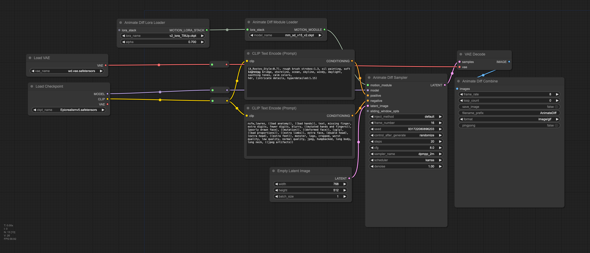
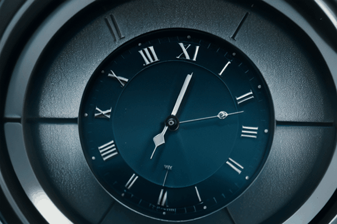

# How to program the workflow in ComfyUI

### Preparation

import following workflow into ComfyUI console, this required AnimatedDiff Evolved Node (https://github.com/Kosinkadink/ComfyUI-AnimateDiff-Evolved) installed via Manager. 




Activate "Enable Dev Mode Option" on ComfyUI Setting Pannel, and then save the workflow as API mode, you will get a json file (workflow_api_txt2gif).

### Progammable workflow

Next we need to parse the json to find out the NodeId.

And then replace the value of targeted Node, for example, new prompt or seed.

Last, just call the api via the wss port of ComfyUI

```
# open the progammable workflow file and replace prompt and seed as needed
def parse_worflow(ws, prompt, seed):
    workflowfile = '{}/workflows/{}'.format(SageMaker_ComfyUI, WORKFLOW_FILE)
    print(workflowfile)
    with open(workflowfile, 'r', encoding="utf-8") as workflow_api_txt2gif_file:
        prompt_data = json.load(workflow_api_txt2gif_file)

        # set the text prompt for our positive CLIPTextEncode
        prompt_data["6"]["inputs"]["text"] = prompt

        # set the seed for our KSampler node
        prompt_data["15"]["inputs"]["seed"] = seed

        return get_images(ws, prompt_data)
 
# call comfyui api       
def generate_clip(prompt, seed, idx=1):
    print(seed)
    ws = websocket.WebSocket()
    ws.connect("ws://{}/ws?clientId={}".format(server_address, client_id))
    images = parse_worflow(ws, prompt, seed)
```

### Examples

- John Wick resting in a dim bedroom, staring pensively at the ceiling, dramatic lighting, high contrast, black and white tones, cinematic perspective --ar 16:9 —q 2


- Extreme closeup of an analog clock face, hands pointing to 3 o'clock, dim lighting, cinematic mood, highly detailed, depth of field, —ar 1:1

