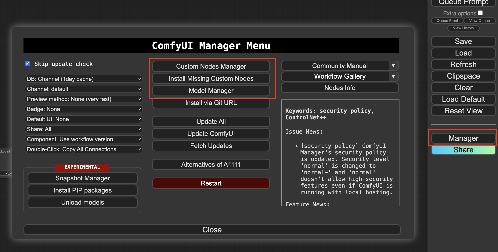
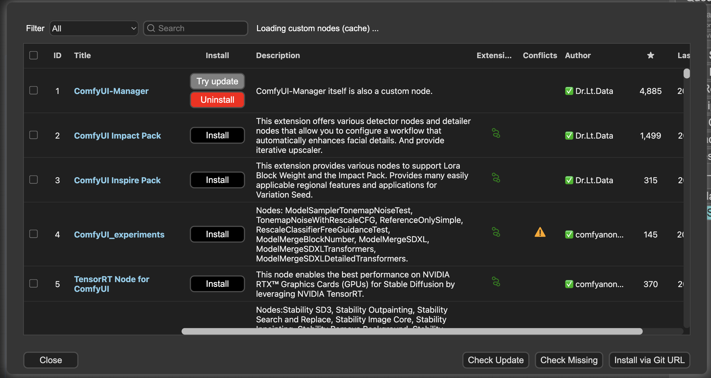
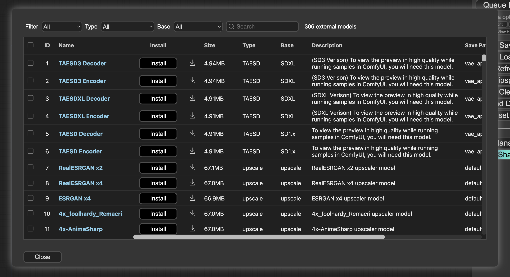

# ComfyUI User Guide

This guide will walk you through the basics of using ComfyUI, an application that allows you to extend its functionality by installing extensions (also known as Custom Nodes). Check out the ComfyUI community for the latest information.

## Installing Extensions (Custom Nodes)

ComfyUI allows you to add new features by installing extensions, which are called Custom Nodes. By default, this solution comes with the [ComfyUI-Manager](https://github.com/ltdrdata/ComfyUI-Manager) extension installed, which makes it easy to install additional extensions and models.

You can install more extensions either from the ComfyUI-Manager, installing manually, or modifying the Dockerfile.

To install an extension from the ComfyUI-Manager, follow these steps:

1. Open the ComfyUI Manager menu by clicking the *Manager* button. Then, select either *Custom Nodes Manager* or *Install Missing Custom Nodes* if there are any missing Custom Nodes in your workflow.

2. Browse and install the extension you want. You'll need to restart the server for the changes to take effect.


## Installing Models

There are several ways to install models in ComfyUI.

### Using ComfyUI-Manager

The [ComfyUI-Manager](https://github.com/ltdrdata/ComfyUI-Manager) has a database of available model installation locations and provides an easy way to install models from a list.

1. Open the ComfyUI Manager menu by clicking the *Manager* button. Then, select *Model Manager*.

2. Install the model you want.


### Manual Installation

You can also install models manually. You'll find some additional examples in the `/scripts/upload_models.sh` file.

```bash
# 1. SSM into EC2
aws ssm start-session --target "$(aws ec2 describe-instances --filters "Name=tag:Name,Values=ComfyUIStack/ASG" "Name=instance-state-name,Values=running" --query 'Reservations[*].Instances[*].[InstanceId]' --output text)" --region $AWS_DEFAULT_REGION

# 2. SSH into Container
container_id=$(sudo docker container ls --format '{{.ID}} {{.Image}}' | grep 'comfyui:latest$' | awk '{print $1}')
sudo docker exec -it $container_id /bin/bash

# 3. install models, loras, controlnets or whatever you need (you can also include all in a script and execute it to install)

# FACE SWAP EXAMPLE Upscaler - https://huggingface.co/ai-forever/Real-ESRGAN
wget -c https://huggingface.co/ai-forever/Real-ESRGAN/blob/main/RealESRGAN_x2.pth -P ./models/upscale_models/
```

## Running a Workflow

You can run any workflow of your choice in ComfyUI. This project provides some sample workflows for you to try out.


To run the face-swap example, follow these steps:
1. Drag and drop the `comfyui_examples/face-swap/face-swap-example.json` file into ComfyUI, or use the ComfyUI-Manager Load Button.
2. Install any missing nodes using the ComfyUI-Manager.
3. Make sure that the checkpoint, LoRA Model, FaceDetection, and Upscaler models are installed. You can install them using the ComfyUI-Manager, or if you have models from different sources, follow the previous section on uploading models, LoRAs, embeddings, etc.
4. Upload a portrait picture that you want to swap into the generated image.
5. Queue the workflow.

ℹ️ Additional examples, like the head-rotate and programmable_pipeline, are available in the comfyui_examples folder.


